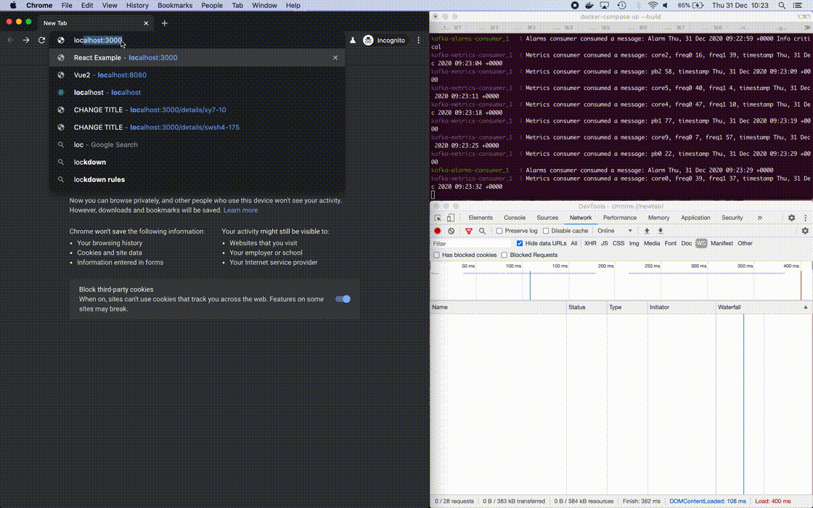

# Retro Cockpit App

To launch run `docker-compose up` 
Please be patient - currently spinning it up takes up to 5min :/  
The app should be running at [http://localhost:3000](http://localhost:3000).

## Tricky parts solved - for future reference

- state management with rematch
- UIRouter integrated with redux
- css modules
- nes.css framework
- FE <-> BE comunication via websockets
- kafka & timescaledb-based stack
- full dockerization
- selenium e2e tests

## 2-do

- [ ] add alarm resolving on the BE
- [ ] add alarms retention policy
- [ ] elimination on non-necessary rerenders
- [ ] speeding up docker build process
- [ ] env-ization
- [ ] add docker-compose for selenium tests
- [ ] add autoprefixer
- [ ] add generic data models
- [ ] how to add configuration of timescale server container to pgadmin container
- [ ] add `wait` to containers to eliminate restarting them

## Known bugs

- [ ] alarm resolving
- [ ] no overflow: hidden for the top container

## Leaving be

- alarms pagination
- `incoming message` button not redirecting to last message
- sending resolved alarms again to FE
